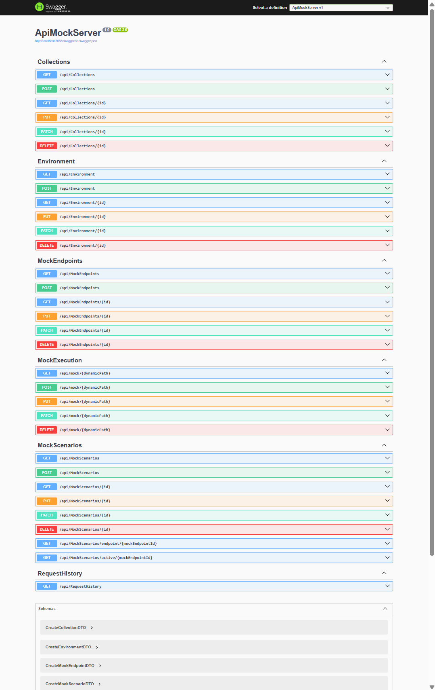
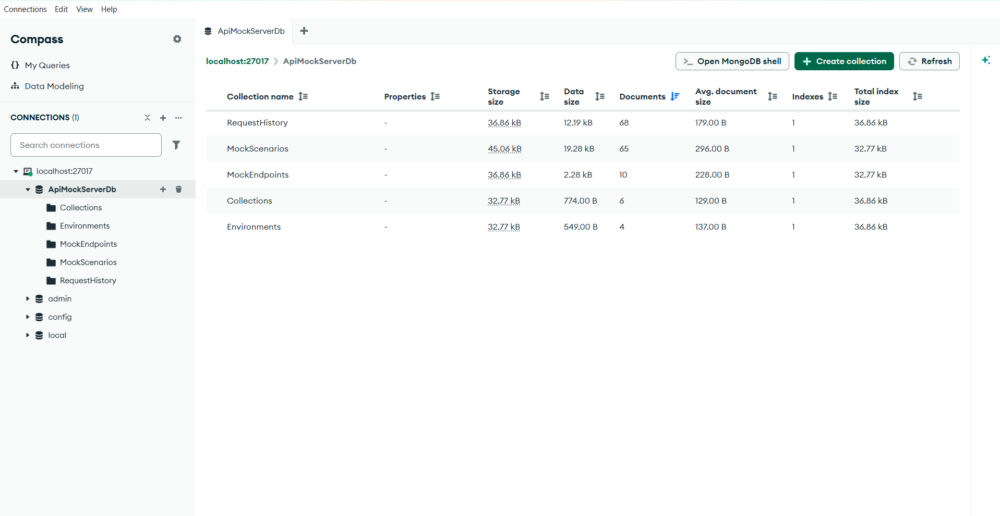
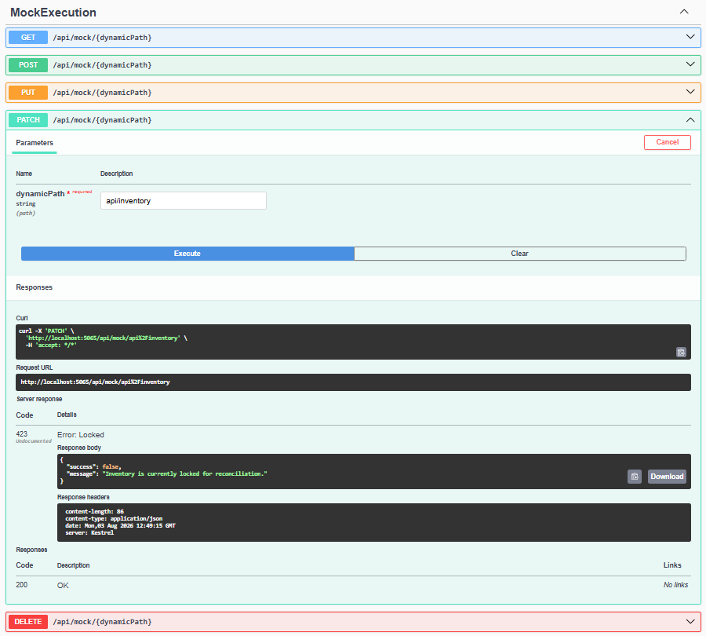

# API Mock Server & Scenario Simulator — Backend

A scalable ASP.NET Core Web API for creating, managing, and executing configurable mock REST APIs with dynamic request routing and scenario-based response simulation.

The backend serves as the execution engine of the API Mock Server & Scenario Simulator. It enables developers to create configurable mock APIs, simulate real-world backend behaviors such as delays, timeout responses, and random failures, while persisting configurations in MongoDB.

---

# Overview

The **API Mock Server & Scenario Simulator** is a full-stack developer tool that enables frontend developers, QA engineers, and integration teams to continue development and testing without depending on backend service availability.

Built using **ASP.NET Core Web API** and **MongoDB**, the backend provides REST APIs for managing mock endpoints, collections, environments, and scenarios while dynamically executing mock requests at runtime.

The project follows a layered architecture using Controllers, Services, Repositories, DTOs, and Models to provide a scalable and maintainable codebase.

---

# Features

## Currently Available

### Mock Endpoint Management

- Create mock endpoints
- Update endpoint configurations
- Delete mock endpoints
- Retrieve endpoint definitions
- Enable / Disable endpoints
- Dynamic endpoint matching
- Parameterized route support

---

### Mock Scenario Management

- Create scenarios
- Update scenarios
- Delete scenarios
- Activate scenarios
- Configure custom responses
- Configure HTTP status codes
- Configure artificial delays
- Configure timeout simulation
- Configure random failure simulation

---

### Dynamic Mock Execution Engine

- Runtime API execution
- Dynamic request routing
- Parameterized endpoint matching
- Active scenario selection
- Dynamic response generation
- Custom HTTP status code execution
- JSON response execution

---

### Collections Management

- Create collections
- Update collections
- Delete collections
- Organize mock endpoints

---

### Environment Management

- Create environments
- Update environments
- Delete environments
- Activate environments

---

### Backend Infrastructure

- RESTful API architecture
- Layered Architecture
- Repository Pattern
- Service Layer
- MongoDB integration
- Swagger / OpenAPI documentation
- Request validation
- JSON-based API responses
- Dependency Injection

---

# Upcoming Features

- Request Logging
- Request History
- Response Templates
- OpenAPI Import
- Rate Limiting Simulation
- Malformed JSON Responses
- Environment Switching
- Performance Metrics

---

# Technology Stack

## Backend

- ASP.NET Core Web API (.NET 8)
- MongoDB
- Swagger / OpenAPI

## Development Tools

- Visual Studio Code
- Git
- GitHub

---

# System Architecture

The backend acts as the execution engine of the API Mock Server & Scenario Simulator.

```

```
                React Frontend
                       │
                REST API (HTTP)
                       │
          ASP.NET Core Web API
                       │
     Dynamic Mock Execution Engine
                       │
                 MongoDB Database


```

Additional architecture documentation is available inside the **docs** directory.

---

# Project Structure

```text
ApiMockServer
│
├── Controllers
│
├── Data
│
├── DTOs
│
├── Interfaces
│
├── Middleware
│
├── Models
│
├── Repositories
│
├── Services
│
├── Properties
│
├── appsettings.json
├── Program.cs
└── README.md
```

---

# Getting Started

## Clone Repository

```bash
git clone <backend-repository-url>
```

---

## Restore Packages

```bash
dotnet restore
```

---

## Configure MongoDB

Update the MongoDB configuration inside

```text
appsettings.json
```

Example

```json
"MongoDbSettings": {
  "ConnectionString": "mongodb://localhost:27017",
  "DatabaseName": "ApiMockServerDb"
}
```

---

## Run Application

```bash
dotnet run
```

Backend URL

```
http://localhost:5065
```

Swagger Documentation

```
http://localhost:5065/swagger
```

---

# REST APIs

## Mock Endpoints

| Method | Endpoint |
|---------|----------|
| GET | `/api/MockEndpoint` |
| GET | `/api/MockEndpoint/{id}` |
| POST | `/api/MockEndpoint` |
| PUT | `/api/MockEndpoint/{id}` |
| PATCH | `/api/MockEndpoint/{id}` |
| DELETE | `/api/MockEndpoint/{id}` |

---

## Mock Scenarios

| Method | Endpoint |
|---------|----------|
| GET | `/api/MockScenarios` |
| GET | `/api/MockScenarios/{id}` |
| GET | `/api/MockScenarios/endpoint/{endpointId}` |
| GET | `/api/MockScenarios/active/{endpointId}` |
| POST | `/api/MockScenarios` |
| PUT | `/api/MockScenarios/{id}` |
| PATCH | `/api/MockScenarios/{id}` |
| DELETE | `/api/MockScenarios/{id}` |

---

## Collections

| Method | Endpoint |
|---------|----------|
| GET | `/api/Collection` |
| GET | `/api/Collection/{id}` |
| POST | `/api/Collection` |
| PUT | `/api/Collection/{id}` |
| PATCH | `/api/Collection/{id}` |
| DELETE | `/api/Collection/{id}` |

---

## Environments

| Method | Endpoint |
|---------|----------|
| GET | `/api/Environment` |
| GET | `/api/Environment/{id}` |
| POST | `/api/Environment` |
| PUT | `/api/Environment/{id}` |
| PATCH | `/api/Environment/{id}` |
| DELETE | `/api/Environment/{id}` |

---

## Dynamic Mock Execution

| Method | Endpoint |
|---------|----------|
| GET | `/api/mock/{dynamicPath}` |
| POST | `/api/mock/{dynamicPath}` |
| PUT | `/api/mock/{dynamicPath}` |
| PATCH | `/api/mock/{dynamicPath}` |
| DELETE | `/api/mock/{dynamicPath}` |

---

# Database

MongoDB currently contains the following collections.

- MockEndpoints
- MockScenarios
- Collections
- Environments

Future collections include

- RequestLogs

---

# Screenshots

## Swagger Documentation



Interactive API documentation generated using Swagger for testing and exploring all backend REST APIs.

---

## MongoDB Collections



MongoDB stores all mock server configurations including endpoints, scenarios, collections, and environments.

---

## Dynamic Mock Execution



The Dynamic Mock Execution Engine resolves incoming requests at runtime, matches configured endpoints, executes the active scenario, and returns configurable responses.

---

# Documentation

The repository contains architecture diagrams and technical documentation.

| Document | Description |
|----------|-------------|
| `docs/system-architecture.png` | Overall system architecture |
| `docs/backend-component-architecture.png` | Backend layered architecture |
| `docs/api-request-lifecycle.png` | Dynamic request execution flow |
| `docs/database-design.png` | MongoDB database design |

---

# Roadmap

## Completed

- ✅ Mock Endpoint CRUD
- ✅ Mock Scenario CRUD
- ✅ Collections CRUD
- ✅ Environment CRUD
- ✅ Dynamic Mock Execution Engine
- ✅ Dynamic Request Routing
- ✅ Parameterized Endpoint Matching
- ✅ Active Scenario Execution
- ✅ Artificial Delay Simulation
- ✅ Timeout Simulation
- ✅ Random Failure Simulation
- ✅ Custom HTTP Status Code Execution
- ✅ Swagger Documentation
- ✅ MongoDB Integration

---

## Planned

- [ ] Request Logging
- [ ] Request History
- [ ] Response Templates
- [ ] OpenAPI Import
- [ ] Rate Limiting Simulation
- [ ] Malformed JSON Responses
- [ ] Environment Switching
- [ ] Performance Metrics
- [ ] Unit Test Expansion
- [ ] API Analytics

---

# Architecture Highlights

The backend follows a clean layered architecture.

```
Client Request
      │
      ▼
Controllers
      │
      ▼
Services
      │
      ▼
Repositories
      │
      ▼
MongoDB
```

The Dynamic Mock Execution Engine performs the following workflow:

```
Incoming Request
        │
        ▼
Endpoint Resolution
        │
        ▼
Scenario Resolution
        │
        ▼
Delay Simulation
        │
        ▼
Timeout Simulation
        │
        ▼
Random Failure Check
        │
        ▼
Dynamic Response Generation
```

---

# Contributing

Contributions are welcome.

To contribute:

1. Fork the repository.
2. Create a feature branch.
3. Follow the existing project architecture.
4. Ensure APIs are tested before submitting.
5. Open a Pull Request describing your changes.

---

# Future Enhancements

The backend has been designed for extensibility and future enterprise capabilities including:

- Request Analytics
- API Usage Metrics
- OpenAPI Import & Export
- Response Templating
- Environment Variables
- Authentication & Authorization
- Team Collaboration
- Role-Based Access Control
- Performance Monitoring
- WebSocket Support

---

# Author

**Sasi Kaladhar**

Developer

**API Mock Server & Scenario Simulator**

A full-stack developer tool built using **ASP.NET Core Web API**, **MongoDB**, and **React** to simplify API development, frontend integration, testing, and backend simulation through configurable mock services.

---